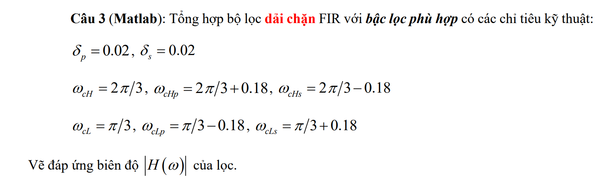
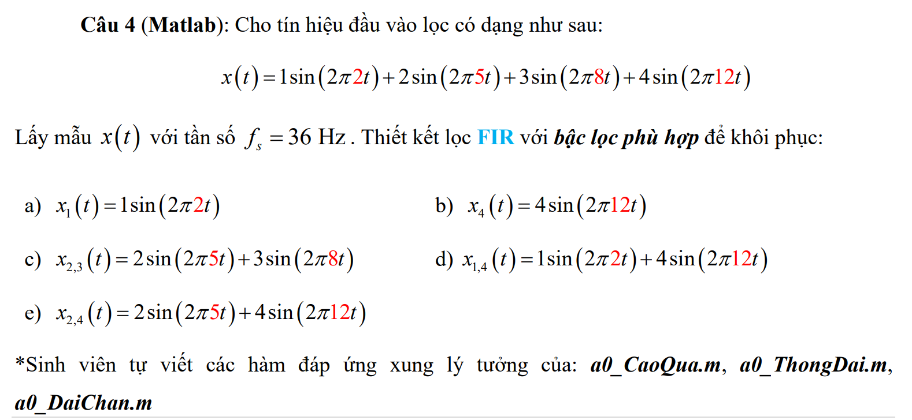

# Lọc FIR và IIR

Chào các bạn,

  + Các hàm con của Câu 4 bạn có thể đặt tên file bất kỳ, còn hàm Main của Câu 4 để chạy ra kết quả nên đặt tên như sau:

     - Cau4b.m,  Cau4c.m,  Cau4d.m,  Cau4e.m

  + Hàm Main của Câu 5 để chạy ra kết quả nên đặt tên như sau:

     - Cau5b.m,  Cau5c.m,  Cau5d.m